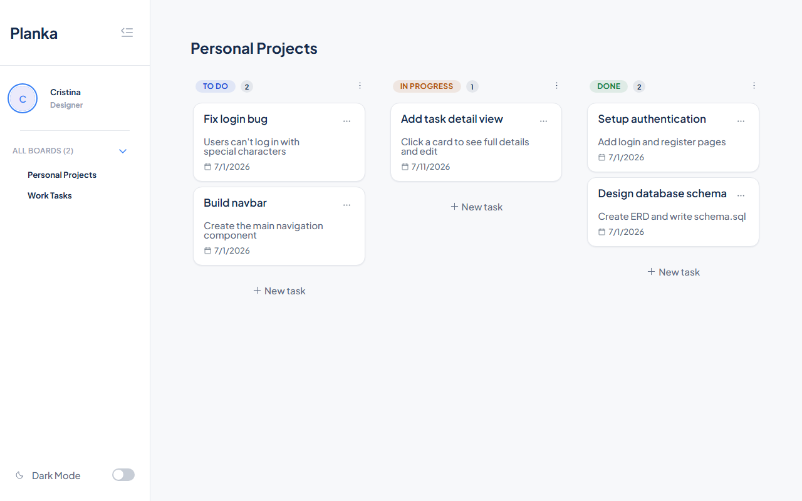

# Planka

A Jira-style Kanban board: projects contain tickets, tickets move across To Do / In Progress / Done via drag-and-drop.

**Status: in progress.** This is a personal learning project — a full-stack app built to practice React and Node end-to-end. Core board flow (create, drag, edit, delete tickets) works; task detail views and multi-board auth are still being built.



## Stack

- **Client:** React + Vite + TypeScript
- **Server:** Node.js + Express
- **Database:** PostgreSQL 16 (Docker)
- **Drag-and-drop:** dnd-kit

## Running it locally

Requires Docker and Node.js.

```bash
# 1. Start Postgres
docker-compose up -d

# 2. Start the API (http://localhost:3000)
cd server
npm install
npm run dev

# 3. Start the client (http://localhost:5173)
cd client
npm install
npm run dev
```

Open the client URL and go to `/board`. The database schema is created automatically on server startup — no migrations to run by hand.

## Project structure

- `client/src/pages/` — page components
- `client/src/components/` — reusable UI components
- `client/src/lib/api.ts` — all API calls
- `server/routes/` — API route handlers
- `server/db/schema.sql` — table definitions

More detail in [docs/architecture.md](docs/architecture.md), [docs/api.md](docs/api.md), and [docs/database.md](docs/database.md).
